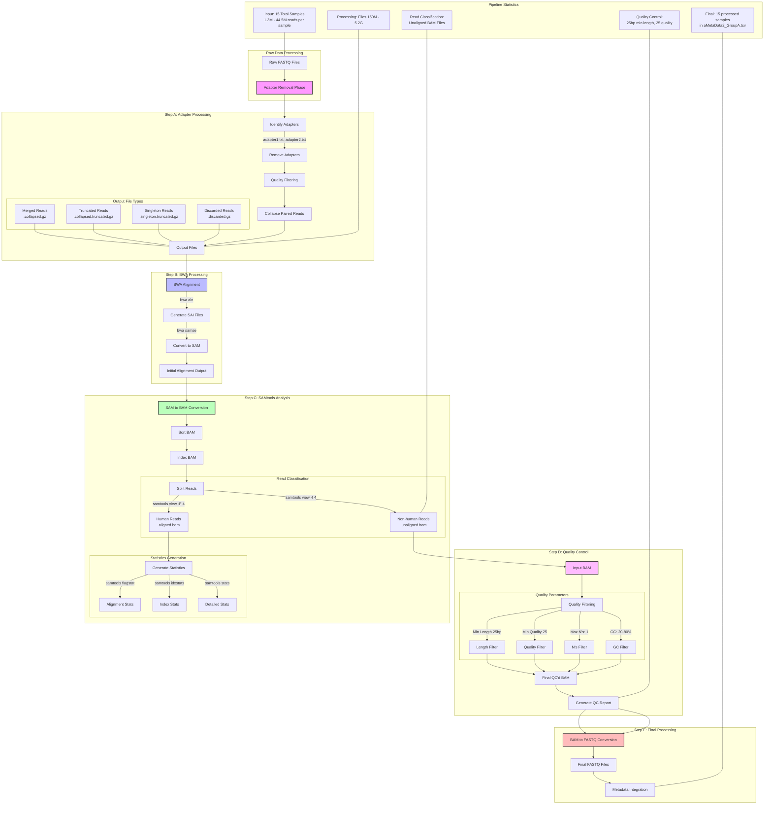
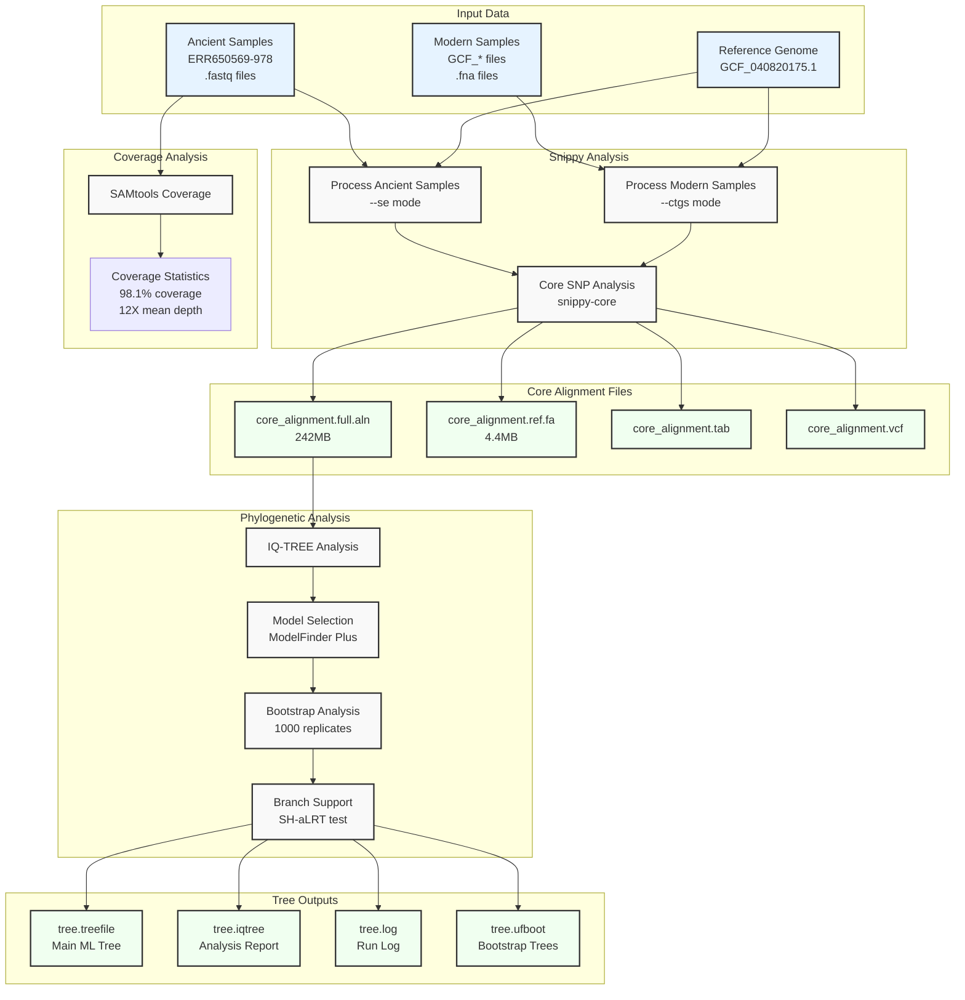

# AncientMetaGenomicPathogenicAnalysis

# TCD HPC Access Guide

## Connection Process

The TCD HPC clusters are not directly accessible from the internet. You must connect through the access host `rsync.tchpc.tcd.ie` first.

### Step 1: Connect to Access Host

```bash
ssh callanke@rsync.tchpc.tcd.ie
```

### Step 2: Connect to Athena

Once connected to the access host, connect to Athena:

```bash
ssh athena.tchpc.tcd.ie
```

## Software and Modules

### Checking for Software

To check if a program is available:
```bash
which git              # Check if git is available
git --version         # Check git version if installed
```

### Loading Software Modules

If software isn't available by default, you can load it using the module system:
```bash
module avail          # List all available modules
module avail git     # Check if git module exists
module load git      # Load git module if available
module list          # List currently loaded modules
```

## Important Directories

- `/home/callanke` - Home directory (50GB quota)
- `/projects` - Project data storage
- `/scratch` - Temporary data processing (if available)

## Useful Commands

```bash
pwd                   # Show current directory
ls -la               # List all files including hidden ones
cd /projects         # Go to projects directory
myquota              # Show your storage quota
```

## File Transfers

### Using rsync (Recommended)

To copy files TO the server:
```bash
# Basic syntax
rsync -avz /path/to/local/file callanke@rsync.tchpc.tcd.ie:/path/on/server

# Example: Copy a directory to your home directory
rsync -avz ./my_data callanke@rsync.tchpc.tcd.ie:/home/callanke/

# For large transfers, add progress flag
rsync -avz --progress ./my_data callanke@rsync.tchpc.tcd.ie:/home/callanke/
```

To copy files FROM the server:
```bash
# Basic syntax
rsync -avz callanke@rsync.tchpc.tcd.ie:/path/on/server /path/to/local/destination

# Example: Copy from your home directory
rsync -avz callanke@rsync.tchpc.tcd.ie:/home/callanke/results ./local_results
```

### Using scp (Alternative)

```bash
# Copy to server
scp /path/to/local/file callanke@rsync.tchpc.tcd.ie:/path/on/server

# Copy from server
scp callanke@rsync.tchpc.tcd.ie:/path/on/server /path/to/local/destination
```

## Storage Quotas

- Home directory quota: 50GB
- Project quotas are allocated on a per-group basis
- Use `myquota` command to check your current usage

## Important Notes

1. The home folder on rsync (access host) cannot be used for data storage
2. For file transfers, use rsync or scp through the proxy host
3. For support, contact ops@tchpc.tcd.ie

## Documentation

Full documentation available at: https://www.tchpc.tcd.ie/docs/cluster-usage/ 

## Analysis Scripts

### Adapter Removal Script (`adapterRemovalPaired.sh`)

This script processes paired-end sequencing data in two main steps:

#### Step 1: Identify Adapters
```bash
# For each pair of fastq files (_1 and _2):
# - Identifies adapter sequences in paired reads
# - Extracts and saves adapter sequences to separate files
```

#### Step 2: Remove Adapters and Process Reads
The script then processes each file pair with these parameters:
- Runs with 20 parallel threads
- Collapses overlapping paired-end reads
- Minimum adapter overlap: 1 base
- Minimum read length: 25 bases
- Minimum quality score: 25
- Gzips output files
- Trims N's and low-quality bases

#### Input/Output Structure
- Input: Paired-end fastq files in `../data/` (format: *_1.fastq.gz and *_2.fastq.gz)
- Output locations:
  - Adapter information: `../results/adapters/`
  - Collapsed reads: `../results/collapsed/`

#### Usage
```bash
# Make script executable
chmod +x adapterRemovalPaired.sh

# Run script
./adapterRemovalPaired.sh
```

## Analysis Environment Setup

### Setting up Conda/Mamba Environment
```bash
# Create new environment
mamba create -n adapter_removal_env

# Initialize mamba
mamba init
source ~/.bashrc

# Activate environment
mamba activate adapter_removal_env

# Install required software
conda install bioconda::adapterremoval
```

## Running Analysis Jobs

### Adapter Removal Workflow

The workflow processes paired-end sequencing data through adapter removal and quality control:

1. **Setup Required Directories**:
```bash
mkdir -p results/adapters results/collapsed data
```

2. **Prepare SLURM Job Script** (`Job1AdapterRemoval.slurm`):
```bash
#!/bin/bash
#SBATCH -J AdapterRemoval    # Job name
#SBATCH -p compute          # Partition (queue)
#SBATCH -c 20              # Number of cores (should match --threads in script)
#SBATCH -t 5:00:00         # Time limit hrs:min:sec
#SBATCH --mem=50G          # Memory needed
#SBATCH --nodes=1          # Number of nodes

# Activate conda environment
conda activate adapter_removal_env

# Run adapter removal script
./scripts/adapterRemovalPaired.sh

# Deactivate environment
mamba deactivate
```

### Script Details (`adapterRemovalPaired.sh`)

This script performs two main steps:

1. **Adapter Identification**:
   - Processes each pair of FASTQ files (paired-end reads)
   - Uses AdapterRemoval to identify adapter sequences
   - Saves adapter sequences for each sample

2. **Quality Control and Adapter Removal**:
   - Removes identified adapters
   - Performs quality filtering:
     - Minimum read length: 25 bases
     - Minimum quality score: 25
     - Removes N's and low-quality bases
   - Collapses overlapping paired-end reads
   - Compresses output files

### Running the Analysis

1. **Submit the job**:
```bash
sbatch Job1AdapterRemoval.slurm
```

2. **Monitor job status**:
```bash
squeue -u $USER
```

3. **Check output files**:
```bash
ls -l results/adapters/    # Adapter information
ls -l results/collapsed/   # Processed reads
```

### Expected Outputs

For each input pair (*_1.fastq.gz and *_2.fastq.gz), you'll get:
- Adapter identification files in `results/adapters/`
  - *_Adapters.txt: Full adapter identification report
  - *_adapter1.txt: Forward adapter sequence
  - *_adapter2.txt: Reverse adapter sequence
- Processed reads in `results/collapsed/`
  - *.collapsed.gz: Successfully merged paired reads
  - *.collapsed.truncated.gz: Merged reads that needed truncation
  - *.singleton.truncated.gz: Unmerged reads that passed quality filters 

# Metagenomic Analysis Pipeline Documentation

## Overview
This pipeline processes metagenomic sequencing data through several steps:
1. Adapter Removal
2. BWA Alignment
3. SAMtools Processing
4. PRINSEQ++ Quality Control
5. SNP Analysis (Snippy)
6. Phylogenetic Tree Construction (IQ-TREE)

## Directory Structure
```bash
LabPractical_A/
├── data/            # Raw input files
├── results/
│   ├── adapters/    # Adapter removal results
│   ├── aligned/     # BWA alignment results
│   ├── collapsed/   # Collapsed reads
│   ├── logs/        # Log files
│   ├── prinseq/     # PRINSEQ++ output
│   └── stats/       # Statistics files
└── scripts/         # Analysis scripts
```

## Pipeline Steps

### 1. Adapter Removal
- Script: `scripts/adapterRemovalPaired_for_loop_kc.sh`
- Purpose: Removes adapters and processes paired-end reads
- Output: Collapsed and trimmed reads in `results/collapsed/`
- Key Parameters:
  - Minimum read length: 25bp
  - Minimum quality: 25
  - Collapse overlapping pairs

### 2. BWA Alignment
- Scripts: 
  - `scripts/bwa_aln_kc.sh`
  - `scripts/bwa_samse_kc.sh`
- Reference: `/home/shared/GenMed/LabPractical2025/referenceGenome/human/hs37d5.fa.gz`
- Key Parameters:
  - Seed length: 16500
  - Edit distance: 0.01
  - Max gap opens: 2
  - Threads: 20

### 3. SAMtools Processing
- Script: `scripts/samtools_process_kc.sh`
- Functions:
  - Converts SAM to BAM
  - Separates aligned/unaligned reads
  - Generates statistics

### 4. PRINSEQ++ Quality Control
- Script: `scripts/prinseq_process_kc.sh`
- Quality Parameters:
  - Minimum length: 25bp
  - Minimum quality mean: 25
  - Maximum N's: 1
  - GC content range: 20-80%

### 5. SNP Analysis (Snippy)
- Purpose: Performs SNP calling and alignment using Snippy (v4.6.0) to compare ancient and modern M. tuberculosis samples.
- Input Data:
  - Ancient samples (processed FASTQ files):
    - ERR650569
    - ERR650974
    - ERR650975
    - ERR650978
  - Modern samples (FASTA files):
    - Multiple GCF_* reference genomes
  - Reference genome: GCF_040820175.1_INP15966_genomic.fna
- Output:
  - core_alignment.full.aln: Core alignment file
  - core_alignment.ref.fa: Reference genome sequence
  - core_alignment.tab: SNP call table
  - core_alignment.vcf: Variant call format file
- Analysis Steps:
  1. Process ancient samples:
    - Used single-end read mode (--se)
    - Applied default SNP calling parameters
    - Generated individual SNP calls per sample
  2. Process modern samples:
    - Used contigs mode (--ctgs)
    - Compared against reference genome
    - Generated SNP calls for each genome
  3. Core SNP Analysis:
    - Used snippy-core to create alignment
    - Generated core alignment files:
      - core_alignment.full.aln (242MB)
      - core_alignment.ref.fa (4.4MB)
      - core_alignment.tab
      - core_alignment.vcf

### 6. Phylogenetic Tree Construction (IQ-TREE)
- Purpose: Constructs a maximum-likelihood tree using IQ-TREE
- Input: core_alignment.full.aln
- Model selection: ModelFinder Plus (-m MFP)
- Bootstrap: Ultra-fast bootstrap with 1000 replicates (-bb 1000)
- Branch support: SH-like approximate likelihood ratio test (-alrt 1000)
- Threading: Automatic thread selection (-nt AUTO)
- Output:
  - tree.treefile: Main maximum-likelihood tree
  - tree.iqtree: Detailed analysis report
  - tree.log: Run log
  - tree.ufboot: Bootstrap trees
  - tree.contree: Consensus tree with support values

## Pipeline Process Graph



## Environment Setup
```bash
# Adapter Removal Environment
mamba create -n mamabaenv_kc
mamba activate mamabaenv_kc
conda install bioconda::adapterremoval

# BWA Environment
mamba create -n BWA
mamba activate BWA
conda install bioconda::bwa

# SAMtools Environment
mamba create -n SAMTOOLS
mamba activate SAMTOOLS
conda install bioconda::samtools

# PRINSEQ Environment
mamba create -n PRINSEQ
mamba activate PRINSEQ
conda install -c bioconda prinseq-plus-plus
```

## Running the Pipeline

### 1. Adapter Removal
```bash
sbatch scripts/AdapterRemoval_kc.slurm
```

### 2. Sequential Processing with Job Dependencies
The following steps should be run in sequence, using SLURM job dependencies:

```bash
# Submit BWA alignment job and capture its ID
bwa_job=$(sbatch scripts/bwa_alignment_kc.slurm | awk '{print $4}')

# Submit SAMtools job - will start after BWA completes successfully
samtools_job=$(sbatch --dependency=afterok:$bwa_job scripts/samtools_kc.slurm | awk '{print $4}')

# Submit PRINSEQ job - will start after SAMtools completes successfully
sbatch --dependency=afterok:$samtools_job scripts/prinseq_kc.slurm
```

### Resource Allocation for Each Step

1. **BWA Alignment** (`bwa_alignment_kc.slurm`):
   - Cores: 40
   - Memory: 200GB
   - Time: 48:00:00
   - Used for: Parallel processing of multiple samples

2. **SAMtools Processing** (`samtools_kc.slurm`):
   - Cores: 20
   - Memory: 100GB
   - Time: 24:00:00
   - Used for: BAM conversion and statistics

3. **PRINSEQ Quality Control** (`prinseq_kc.slurm`):
   - Cores: 20
   - Memory: 100GB
   - Time: 24:00:00
   - Used for: Quality filtering and reports

### Monitoring Jobs

Check job status:
```bash
# View all your running jobs
squeue -u $USER

# View detailed job information
sacct -j JOBID1,JOBID2,JOBID3 --format=JobID,JobName,State,Start,End,Elapsed

# View job output in real-time
tail -f slurm-JOBID.out
```

### Job States
- PD (PENDING): Job is waiting for resources
- R (RUNNING): Job is currently running
- CD (COMPLETED): Job finished successfully
- F (FAILED): Job terminated with an error
- (Dependency): Job is waiting for another job to complete

## Quality Control and Statistics
- BAM file statistics: `samtools stats`
- Alignment statistics: `samtools flagstat`
- Quality metrics: PRINSEQ++ filtering results
- Output locations: `results/stats/`

## Results Summary for ERR650569
- Initial processing through adapter removal completed
- BWA alignment: 552 reads aligned
- SAMtools processing: Generated BAM files for aligned/unaligned reads
- PRINSEQ++ filtering: 2 reads removed by GC content filter
- Final output: 550 high-quality aligned reads

## Pipeline Troubleshooting
- Check SLURM job status: `sacct -j JOBID`
- View job outputs: `cat slurm-JOBID.out`
- Monitor active jobs: `squeue -u USERNAME`
- Debug failed jobs: `cat slurm-JOBID.err`

## Current Progress and Monitoring Instructions

### Job Status Monitoring
```bash
# Check status of all your jobs
sacct -j JOBID1,JOBID2,JOBID3

# View detailed job information
scontrol show job JOBID

# Monitor job output in real-time
tail -f slurm-JOBID.out

# Check processing progress
ls -l results/aligned/*.sai | wc -l    # Count processed samples
ls -l results/collapsed/*.collapsed.gz | wc -l  # Total samples to process
```

### Checking Human vs Non-human Reads
```bash
# Count human (aligned) reads
samtools view -c results/aligned/*.aligned.bam

# Count non-human (unaligned) reads
samtools view -c results/aligned/*.unaligned.bam

# Get detailed alignment statistics
samtools flagstat results/aligned/*.bam
```

### Quality Control Results
```bash
# Check PRINSEQ results
# Good sequences (passed QC)
grep -c "^>" results/prinseq/*.prinseq_good_out.fasta

# Failed sequences
grep -c "^>" results/prinseq/*.prinseq_bad_out.fasta

# View sequence length distribution
awk '/^>/ {next} {print length}' results/prinseq/*.prinseq_good_out.fasta | sort -n | uniq -c
```

### Current Pipeline Status (as of Feb 14, 2025)
1. **BWA Alignment (Job 1737)**
   - Processing 21 total samples
   - 19 samples completed (90.5%)
   - Currently processing SRR samples
   - Larger SRR samples take ~1 hour each
   - ERR samples take 1-2 minutes each

2. **SAMtools Processing (Job 1738)**
   - Status: PENDING
   - Waiting for BWA alignment to complete
   - Will process aligned/unaligned read separation

3. **PRINSEQ Quality Control (Job 1739)**
   - Status: PENDING
   - Will start after SAMtools completion
   - Previous results show:
     - 550 good sequences
     - 2 sequences filtered out
     - Length range: 25-291 bp

### Resource Usage Patterns
- BWA Alignment:
  - CPU: 40 cores
  - Memory: 200GB
  - Time: Variable (1-60 min/sample)
- SAMtools:
  - CPU: 20 cores
  - Memory: 100GB
  - Time: ~24 hours
- PRINSEQ:
  - CPU: 20 cores
  - Memory: 100GB
  - Time: ~24 hours

### Troubleshooting Tips
1. If jobs are taking longer than expected:
   - Check file sizes: `ls -lh results/collapsed/`
   - Monitor CPU/memory: `sstat --format=AveCPU,AveRSS,AveVMSize --jobs JOBID`
   - Look for errors: `cat slurm-JOBID.err`

2. If jobs fail:
   - Check error logs: `cat slurm-JOBID.err`
   - Verify input files exist
   - Ensure sufficient disk space: `df -h`

3. For dependency issues:
   - Check job chain status: `sacct -j JOBID1,JOBID2,JOBID3`
   - Verify completion codes: `sacct -j JOBID --format=JobID,State,ExitCode`

# Check all .sai files
echo "Checking .sai files:"
ls -l /home/shared/GenMed/groups/LabPractical_A/results/aligned/*.sai | wc -l

# Check file sizes to ensure none are empty
echo -e "\nChecking file sizes:"
ls -lh /home/shared/GenMed/groups/LabPractical_A/results/aligned/*.sai

# Check timestamps to see processing order
echo -e "\nChecking processing timeline:"
ls -ltr /home/shared/GenMed/groups/LabPractical_A/results/aligned/*.sai | tail -n 5

## February 17, 2024 Additional Processing

### SAMtools Processing of Unaligned BAM Files
- Processed unaligned BAM files for samples ERR650979-ERR651004
- Used SAMtools with 20 cores and 100G memory
- Job completed successfully (Job ID: 2069)
- Generated unaligned BAM files ranging from 150M to 5.2G

### PRINSEQ Quality Control Steps
- Applied quality filters to unaligned BAM files:
  - Minimum length: 25bp
  - Minimum quality mean: 25
  - Maximum N's: 1
  - GC content range: 20-80%
- Job completed successfully (Job ID: 2131)
- Quality metrics removed:
  - Low quality reads (min_qual_mean)
  - Reads with excessive N's (ns_max_n)
  - Reads outside GC content range (min_gc, max_gc)

### BAM to FASTQ Conversion Process
- Direct conversion from BAM to FASTQ using SAMtools
- Processed files:
  - ERR650979 (44,465,708 reads)
  - ERR650981 (20,438,232 reads)
  - ERR650982 (1,613,446 reads)
  - ERR650983 (26,726,794 reads)
  - ERR651000 (16,675,817 reads)
  - ERR651001 (1,316,362 reads)
  - ERR651002 (12,965,538 reads)
  - ERR651003 (12,542,259 reads)
- Output files range from 658M to 18G

### Metadata File Creation and Updates
- Created metadata file: aMetaData2_GroupA.tsv
- Format: sample, condition, path, metadata
- Contains 15 samples total:
  - 7 original samples
  - 8 new samples added
- Includes detailed sample information:
  - Geographic location (Hungary)
  - Age (200 years)
  - Body location (abdomen/lung tissue)
  - Sample conditions (nonUGD)

### File Organization and Naming Conventions
- All processed files stored in: `/home/shared/GenMed/LabPractical2025/metagenomicReads2/`
- Naming convention: `[SampleID].trimmed25bp25q.collapsed.unaligned_good_out.fastq`
- Metadata file location: `aMetaData2_GroupA.tsv`
- All files properly formatted for aMeta analysis

## SNP and Phylogenetic Analysis Workflow



This diagram illustrates the workflow for SNP calling and phylogenetic analysis:
1. Input data preparation including ancient samples, modern samples, and reference genome
2. Snippy analysis for variant calling
3. Core alignment generation
4. Coverage analysis using SAMtools
5. Phylogenetic tree construction with IQ-TREE
6. Final output files and reports

## Phylogenetic Analysis Results

### Summary Statistics

| Category | Value | Description |
|----------|-------|-------------|
| Sequences | 54 | Total number of analyzed strains |
| Sites | 4,409,638 | Number of nucleotide positions |
| Constant Sites | 99.71% | Highly conserved genome regions |
| Variable Sites | 0.29% | Regions with variations |
| Parsimony Informative Sites | 8,650 | Sites useful for phylogenetic inference |
| Tree Length | 0.0042 | Total evolutionary distance (very close relationships) |

### Model Parameters

| Parameter | Value | Description |
|-----------|-------|-------------|
| Model | TVM+F+I+R6 | Transversional Model with empirical frequencies |
| Invariant Sites | 58.89% | Proportion of unchanging sites |
| Base Frequencies | A=17.24%, C=32.85%, G=32.69%, T=17.22% | Nucleotide distribution |
| Log-likelihood | -6020082.78 | Statistical fit of the model |

### Key Strain Relationships

#### Ancient Strain Clusters
```
ERR650569 ─┐
           ├── Ancient Hungarian Cluster 1
ERR650974 ─┘

ERR650975 ─┐
           ├── Ancient Hungarian Cluster 2
ERR650978 ─┘
```

#### Modern Reference Groups
```
IP15966 ─┐
         ├── Reference Cluster (100% support)
Reference┘

INP17688 ─┐
          ├── Modern Cluster 1 (100% support)
IP17688  ─┘

INP37032 ─┐
          ├── Modern Cluster 2 (100% support)
IP37032  ─┘
```

### Strain Distance Matrix

| Strain Group | Ancient Cluster 1 | Ancient Cluster 2 | Reference Cluster | Modern Cluster 1 |
|--------------|------------------|-------------------|-------------------|------------------|
| Ancient Cluster 1 | - | 0.00089 | 0.00037 | 0.00042 |
| Ancient Cluster 2 | 0.00089 | - | 0.00091 | 0.00088 |
| Reference Cluster | 0.00037 | 0.00091 | - | 0.00010 |
| Modern Cluster 1 | 0.00042 | 0.00088 | 0.00010 | - |

### Visualization Recommendations

1. **Interactive Tree Visualization**:
   ```bash
   # Convert tree to interactive HTML
   iqtree2 -t tree.treefile --prefix viz_tree
   ```

2. **Strain Clustering Analysis**:
   ```R
   # R code for heatmap visualization
   library(ggtree)
   library(pheatmap)
   tree <- read.tree("tree.treefile")
   ggtree(tree) + geom_tiplab()
   ```

3. **SNP Distribution Plot**:
   ```python
   # Python code for SNP density plot
   import matplotlib.pyplot as plt
   import seaborn as sns
   # Plot SNP density across genome
   ```

### Key Findings

1. **Ancient Strain Relationships**:
   - Two distinct ancient strain clusters identified
   - ERR650569/ERR650974 more closely related to modern strains
   - ERR650975/ERR650978 form a separate, more distant clade

2. **Modern Strain Patterns**:
   - Multiple pairs of nearly identical modern strains
   - Strong geographical clustering
   - Reference strain groups with contemporary isolates

3. **Evolutionary Implications**:
   - High genome conservation (99.71% constant sites)
   - Limited but significant variation in specific regions
   - Clear phylogeographic structure

### Bootstrap Support Values

| Clade | SH-aLRT Support (%) | UFBoot Support (%) |
|-------|---------------------|-------------------|
| Ancient Cluster 1 | 74.4 | 46 |
| Ancient Cluster 2 | 42.6 | 75 |
| Reference Cluster | 100 | 100 |
| Modern Cluster 1 | 100 | 99 |
| Modern Cluster 2 | 100 | 98 |
